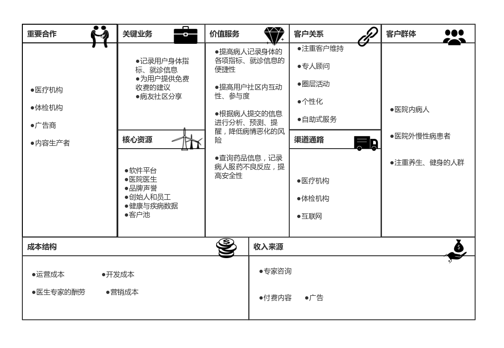

# 
健康管理软件构想
   

杨笑-MF1932220(PM)&nbsp; 
薛晓波-MF1932216&nbsp;
许子桓-MF1932215&nbsp;
黄迪-MF1932071

  

---
 
## **一、背景**  
随着生活水平与质量的提升，人们的健康意识提高，越来越关注自身的健康情况,在现阶段中国社会的条件下，健康管理将成为公共卫生建设重要抓手，而随着老龄化、慢性病趋势加深，人口结构变化、收入增长、城镇化以及“2030健康中国”战略等社会背景，都将推动健康管理产业快速发展。另外，互联网与大数据等技术迅速发展，为健康管理提供了良好的支撑环境。

## **二、问题概述**
在现实的医疗实践中，我们发现有许多患者或患者家属都有记录就诊情况和日常身体健康指标的习惯，从而在日后的就诊过程中方便医生参考，尤其是对与糖尿病、高血糖等慢性疾病来说，日常的健康情况记录是十分重要的，很多患者及家属会在家中自行测量血压、血糖、体重等指标，也会记录医院检查、体检等数据。但是我们发现，大多数人仍然使用纸质记录的方式，这导致了记录不方便，容易丢失，且数据难以充分利用。我们希望能够为用户提供一个方便实用的健康管理工具，来便捷地记录用户的身体健康数据，并且充分利用患者的数据记录用作统计分析，进而进行统计分析等操作，并且提供其他一些健康管理相关的服务。   
  
<strong>解决的核心问题：</strong>  
- 传统的记录身体健康情况的方式不方便
- 身体健康数据难以得到充分利用
- 无法根据身体情况得到及时有效的建议  
  
## **三、期望** 
- 健康日志，记录身体各项指标和就诊结果等信息
- 利用大数据分析，对用户对健康数据进行分析预测
- 根据健康数据，给出健康建议（推荐饮食、作息、运动等）
- 药品信息，可以查询药品的信息，记录自己的用药情况（不良反应等）
- 病友分享，同类病人可分享患病经历、就诊记录、治愈经验等信息，形成社区
- 提供健康菜谱、健康讲座视频内容（部分内容收费）
- 专家问答，及时有效的在线专家咨询（可收费）
- 软件以最便捷简单的方式获取，如微信小程序
 
## **四、商业模式画布** 

