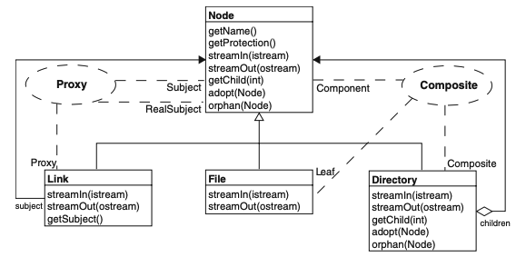

# 关于UML类图中不同设计模式表示效率的实证研究  

### Gerardo Cepeda Porras · Yann-Gaël Guéhéneuc    
出版：2010.02.27  
© Springer Science+Business Media, LLC 2010  
编辑：Laurie Williams.  
  
## 摘要  
设计模式在软件工程界被公认为是对反复出现的设计问题的有用解决方案，它们可以提高程序的质量。开发人员在设计和实现程序时越来越多地使用它们。因此，程序中使用的设计模式的可视化对于有效地了解其工作方式可能很有用。当前，用于可视化设计模式的通用表示法是UML协作图。先前的工作注意到UML表示形式中的一些限制，并提出了新的表示形式来解决这些限制。但是，这些工作都没有进行实证研究以将其新表示形式与UML表示形式进行比较。我们设计并进行了一项实证研究，以收集有关开发人员在与设计模式理解相关的基本任务（即，确定组成，角色，参与）上的基本绩效的数据，以评估三种视觉表示的影响并将其与UML进行比较。我们使用眼动仪评估了研究执行过程中开发人员的努力程度。收集的数据及其分析表明，与UML协作符号相比，构造型增强的UML图在识别组成和角色方面更为有效。 UML表示形式和模式增强的类图对于查找参与设计模式的类（即识别参与）更有效。  
  
**关键词：** 眼动追踪；设计模式；可视化；实证研究；UML类图
  
## 1 介绍    
需要对程序进行理解，以构建程序体系结构的心智表示，并有效地开发和维护程序。 图表是构建这些心智表征的必不可少的视觉工具，突出了有关对象及其关系的有用信息。 在面向对象的软件工程中，对象由类表示，UML类图是表示程序的事实标准。 这些类图被认为可以通过减少开发人员构建心智模型的努力来促进程序理解。 在程序理解文献中对它们进行了广泛的研究，并且存在许多用于构建或生成UML类图的工具。  
  
设计模式是对设计面向对象程序时反复出现的问题的解决方案。他们总结并提出了明确的良好设计规范。软件工程界指出，例如，对设计模式的了解和良好使用对于提高程序的理解和质量很有用。目前，可视化设计模式的一种常见表示法是UML协作表示法，下面介绍UML，图1中举例说明。自从它在GoF的《设计模式》一书中首次使用以来，这种表现形式就很常见，并且它的使用得到了包括Rebecca Wirfs-Brock在内的著名设计师/架构师的支持。以前的工作指出了这种表示的一些局限性(如第2节中所讨论的)，并提出了替代表示。这些表现形式从强烈的视觉到强烈的文本。我们可以将这些表示分为两组:非基于UML的表示和基于UML的表示。这两个组可以分为两个子组:单图表示和多图表示。   
  

  

    
***图1 UML协作图（从Vlissides（1998）复制）在一个简单的文件系统模型上***

  
但是，先前的工作都没有进行过实证研究，以将其提议的表示与常见的表示进行比较。 因此，进行实证研究来评估UML图中可视化设计模式的表示的效率是很重要的: 首先，它提供了一个比较当前和将来表示法的框架；其次，它表明符号的优点和缺点；第三，其结果可用于激励工具构建者为不同任务使用不同的符号。 特别是，它可以为程序理解的未来研究提供基础，以进一步改善现有表示形式，从而帮助开发人员为手头的任务和研究人员选择合适的表示形式。  
  
在本研究中，我们仅考虑基于UML的单图表示，因为这组表示是软件工程界目前使用最多的。 因此，我们保留了三种表示来分析和比较开发人员使用UML表示的效果。 我们之所以选择这些表示形式，是因为它们是少数尝试使用基于UML的单件图来提出UML协作表示法的替代方法的主要代表。这些表示是：  
  

  高级软件设计

  谁谁胡思UI放假就能开发技术端口京津冀快快乐乐 快来快

